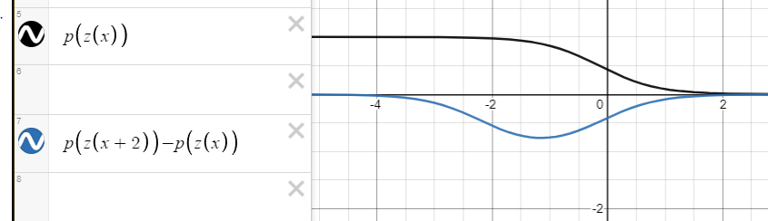

```{r}
# Exploring datasets
  # Returns the first parts of a vector, matrix, table, data frame or function.
  head(x)                         
  # Returns the last parts of a vector, matrix, table, data frame or function.
  tail(x)                         
  # A matrix of scatterplots is produced.
  pairs(x)                        
  # Print summary statistics for each variable in a dataset.
  summary(x)
  
  

# Simple linear regression
  # Fit linear models. Don't forget to attach(data) to use column names.
  my.lm.fit <- lm(y ~ x, data)
  # Get more info about the model
  summary(my.lm.fit)
  # Use the model to make a prediction. Do ?predict.lm for more
  predict(my.lm.fit, data[])
  
# Random sampling
  # Sample n elements from the set x (without replacement by default).
  sample(x, n)
  
# Misc
  # quosure style lambda function
  ~ my_function(.)
  # image syntax
  
```